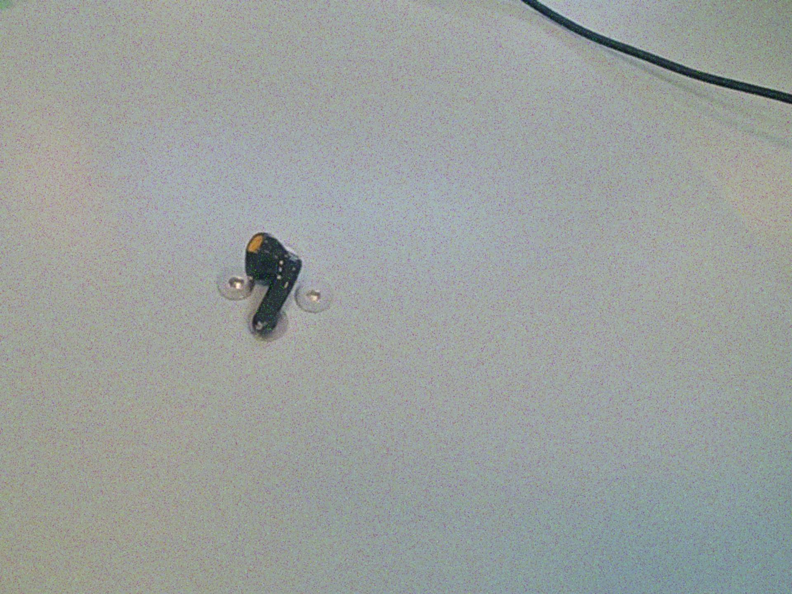
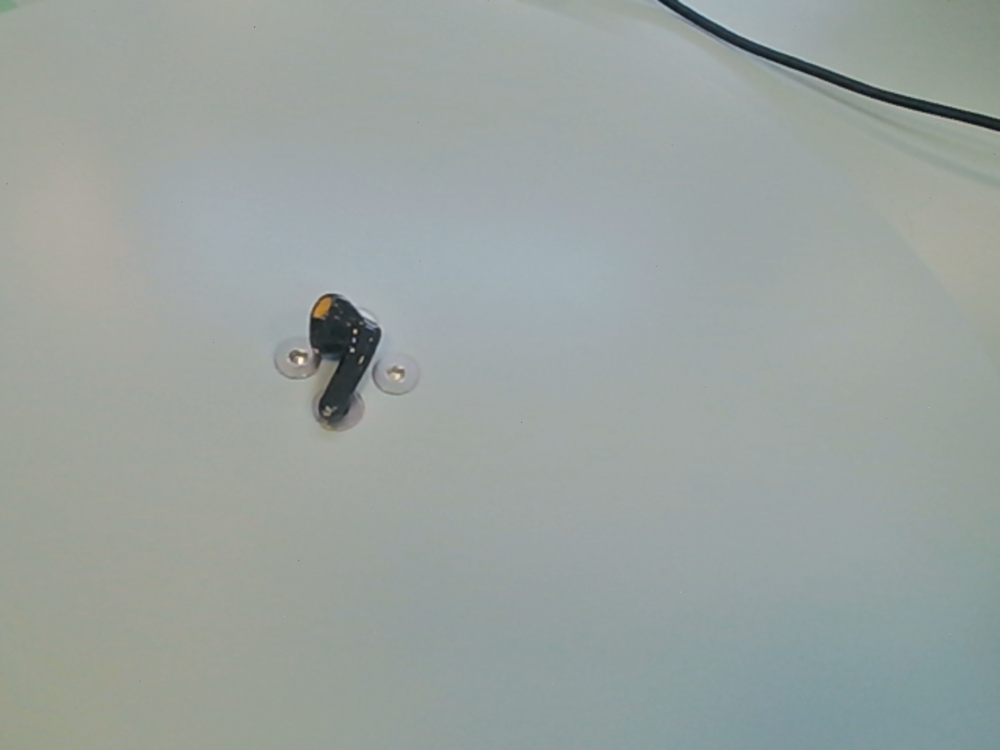

# 📷 IoT Visual Perception & Image Restoration Toolkit | 物联网视觉感知与图像复原工具箱

[](https://www.python.org/)
[](https://opencv.org/)
[](LICENSE)
[](https://www.hhu.edu.cn/)

[English](#-english-introduction) | [中文说明](#-项目中文介绍)

---

## 📖 English Introduction

This project, developed at the **College of IoT Engineering, Hohai University**, implements a comprehensive workflow for digital image processing. It is designed to simulate environmental degradation (noise, blur) common in IoT edge devices and applies classical computer vision algorithms to restore signal quality.

Key implementations include **Wiener Filtering** for motion deblurring in the frequency domain and **Bilateral Filtering** for edge-preserving denoising.

### ✨ Key Features

* **⚡ Noise Simulation**:
    * Gaussian Noise (simulating sensor thermal noise).
    * Salt & Pepper Noise (simulating transmission errors).
* **🔍 Advanced Denoising**:
    * Comparative analysis of 5 filters: Mean, Box, Gaussian, Median, and **Bilateral Filter**.
* **🛠 Image Restoration**:
    * **Inverse Filtering**: Basic frequency domain restoration.
    * **Wiener Filtering**: Robust restoration for motion-blurred images minimizing mean square error (MSE).
* **🎨 Enhancement & Compression**:
    * Histogram Equalization for contrast adjustment.
    * Adaptive JPEG compression for bandwidth-constrained IoT transmission.
* **🔄 Geometric Transformations**:
    * Affine operations: Rotation, Translation, Scaling, and Flipping.

### 🚀 Quick Start

```bash
# Clone the repository
git clone [https://github.com/YourUsername/IoT-Image-Restoration.git](https://github.com/YourUsername/IoT-Image-Restoration.git)
cd IoT-Image-Restoration

# Install dependencies
pip install -r requirements.txt

# Run Denoising Demo
python main.py --input data/original/14_04_44.png --mode denoise
````

-----


## 📖 项目中文介绍

本项目开发于 **河海大学物联网工程学院**，实现了一套完整的数字图像处理工作流。该工具箱旨在模拟物联网边缘设备常见的环境退化（如噪声、模糊），并应用经典的计算机视觉算法恢复信号质量。

核心实现包括用于频域运动去模糊的 **维纳滤波（Wiener Filtering）** 和用于边缘保持去噪的 **双边滤波（Bilateral Filter）**。

### ✨ 核心功能

  * **⚡ 噪声模拟**：
      * 高斯噪声（模拟传感器热噪声）。
      * 椒盐噪声（模拟数据传输错误）。
  * **🔍 高级去噪**：
      * 5种滤波器的对比分析：均值、方框、高斯、中值以及 **双边滤波**。
  * **🛠 图像复原**：
      * **逆滤波**：基础的频域复原算法。
      * **维纳滤波**：最小化均方误差（MSE），对运动模糊图像有鲁棒的复原效果。
  * **🎨 增强与压缩**：
      * 直方图均衡化用于对比度调整。
      * 自适应 JPEG 压缩，适用于带宽受限的物联网传输场景。
  * **🔄 几何变换**：
      * 仿射操作：旋转、平移、缩放和镜像翻转。

### 📂 项目结构

```text
IoT-Image-Restoration/
├── data/
│   ├── original/          # 输入参考图像
│   └── results/           # 处理结果（自动生成）
├── src/
│   ├── noise.py           # 噪声生成与 PSF 模拟
│   ├── filters.py         # 空间域滤波器
│   ├── restoration.py     # 频域复原 (FFT/Wiener)
│   ├── transform.py       # 几何变换
│   ├── enhance.py         # 对比度增强
│   └── io_utils.py        # 鲁棒的 IO 处理 (支持中文路径)
├── main.py                # 命令行入口
├── requirements.txt       # 依赖库
└── README.md              # 说明文档
```

### 📊 结果展示 (Results)


| 高斯加噪 (Gaussian) | 中值滤波复原 (Median Restorationo |
| || 


### 📝 数学原理 (Mathematical Background)

**维纳滤波公式 (Wiener Filter Formula)**:

$$ \hat{F}(u,v) = \left[ \frac{H^*(u,v) S_{xx}(u,v)}{|H(u,v)|^2 S_{xx}(u,v) + S_{\eta\eta}(u,v)} \right] G(u,v) $$

其中：

  * $H(u,v)$ 为退化函数 (PSF)。
  * $G(u,v)$ 为退化图像。
  * $K$ (信噪比倒数) 用于稳定复原过程。

-----

## 👤 作者 (Author)

  * **姓名**:苏跃（Yue Su）
  * **学校**: 河海大学 (Hohai University)
  * **学院**: 信息科学工程学院 (College of information science and technology)
  * **联系方式**: suyuehh@163.com


